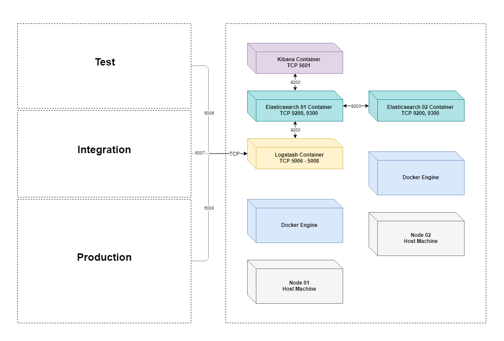

# docker-elk-cluster
Elastic Stack multi-node cluster with Docker Compose.
## Getting Started

These instructions will get you a copy of the project up and running on your local machine for development and testing purposes.
### Prerequisites

We need to set the **vm.max_map_count** kernel parameter:

```
sudo sysctl -w vm.max_map_count=262144
```
To set this permanently, add it to **/etc/sysctl.conf** and reload with **sudo sysctl -p**


